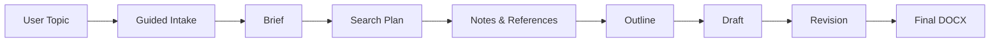
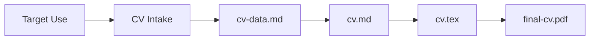

# paperAgent (readme.md 文件全部由 qwen-coder 生成)

> A Codex skill for research paper writing, literature-grounded drafting, and LaTeX CV generation.

面向科研写作、文献证据链、论文草稿迭代和 LaTeX 简历生成的个人研究写作助手。


**Last Updated:** 2026-04-26

---

## What is paperAgent?

paperAgent is **not** a "input topic, get full paper" one-shot generator. It is an interactive research-writing assistant that:

- Starts by asking a few high-value questions to clarify paper type, language, scope, and constraints
- Breaks the writing process into traceable stages: intake → brief → search plan → notes & references → outline → draft → revision → final DOCX
- Emphasizes evidence chains, source quality, technical reasoning, and auditable inference
- Reduces repetition and AIGC-like phrasing through structural revision and expression refinement
- Supports LaTeX CV / resume generation with classic, compact, modern, and academic styles

It is designed for researchers, students, and practitioners who want a **human-in-the-loop** writing workflow rather than black-box text generation.

---

## Features

### Paper Workflow

| Feature | Description |
|---------|-------------|
| 🎯 Guided topic clarification | Interactive interview to sharpen problem, scope, and angle |
| 🔍 Search query planning | Keyword extraction, synonym expansion, exclusion rules |
| 📚 Literature triage | Source priority: peer-reviewed → preprints → docs → blogs → news |
| 🏗️ Outline construction | Defensible argument structure before prose drafting |
| ✍️ Manuscript drafting | Original language writing, not summary stitching |
| 🔁 Revision & refinement | Lower repetition and AIGC-like phrasing |
| 📄 DOCX export | Deliverable `final-manuscript.docx` |

### CV Workflow

| Feature | Description |
|---------|-------------|
| 🎓 Academic CV | Complete publication list, research outputs, service |
| 💼 Research internship resume | Projects, methods, skills, publications/preprints |
| 🏭 Industry resume | One-page, ATS-friendly, outcome-oriented bullets |
| 🌐 Language support | Chinese, English, bilingual output |
| 🎨 Template styles | Classic, compact, modern, academic LaTeX templates |
| 📝 Compilation | XeLaTeX / Overleaf support, optional PDF export |

---

## Workflow Diagram

### Paper Writing Flow



### CV/Resume Flow



---

## Quick Start

The installable unit is the `paper-agent/` directory (not the old `skills/` folder).

### Installation

**Windows:**
```powershell
Copy-Item -Recurse .\paper-agent $env:USERPROFILE\.codex\skills\
```

**macOS / Linux:**
```bash
cp -r ./paper-agent ~/.codex/skills/
```

### Verify Installation

**PowerShell:**
```powershell
$skillPath = "$env:USERPROFILE\.codex\skills\paper-agent"
Test-Path "$skillPath\SKILL.md" -and `
Test-Path "$skillPath\ref\interactive-intake.md" -and `
Test-Path "$skillPath\script\export_final_docx.py"
```

**Bash:**
```bash
skill_path="$HOME/.codex/skills/paper-agent"
[ -f "$skill_path/SKILL.md" ] && \
[ -f "$skill_path/ref/interactive-intake.md" ] && \
[ -f "$skill_path/script/export_final_docx.py" ] && \
echo "OK" || echo "FAIL"
```

Expected layout:
```
~/.codex/skills/paper-agent/
├── SKILL.md
├── ref/
│   ├── citation-style.md
│   ├── cv-latex-guide.md
│   ├── interactive-intake.md
│   ├── paper-template.md
│   ├── quality-checklist.md
│   └── source-priority.md
└── script/
    ├── build_search_queries.py
    ├── compile_latex_cv.ps1
    ├── export_final_docx.py
    ├── init_cv_project.py
    └── init_paper_project.ps1
```

---

## Project Structure

```text
paperAgent/
├── paper-agent/          # Self-contained Codex skill package
│   ├── SKILL.md          # Main skill definition (entry point)
│   ├── ref/              # Reference documents
│   └── script/           # Helper scripts
├── papers/               # Paper projects (user workspace)
├── cvs/                  # CV/resume projects (user workspace)
├── ref/                  # Repository-level references
├── script/               # Helper scripts at repo level
└── log/                  # Task and revision logs
```

**Important:**
- `paper-agent/` is the core publishable and installable unit
- `papers/`, `cvs/`, `log/` are user workspaces — do not commit real private content
- All files are UTF-8 encoded

---

## Example Usage

```text
Use paperAgent to help me write a Chinese course paper about cache coherence in heterogeneous architecture.
```

```text
Create an academic CV in English for a PhD application, using a clean LaTeX style.
```

```text
Help me turn this rough idea into a defensible paper outline before drafting.
```

---

## My Stack

This project uses/adapts the following tools and technologies:

| Category | Tools |
|----------|-------|
| **Core** | Codex skill system |
| **Format** | Markdown as intermediate writing format |
| **Scripts** | Python helper scripts, PowerShell wrappers (Windows) |
| **Export** | DOCX export via Python script |
| **Typesetting** | LaTeX / XeLaTeX for CV generation |
| **Cloud** | Overleaf-compatible LaTeX source |
| **Optional** | Chrome for literature search |
| **Optional** | Zotero for reference management |
| **Optional** | Microsoft Word for final document polishing |

---

## Inspiration

This project was motivated by several observations about academic writing and AI assistance:

- **Real academic writing is iterative**, not one-shot generation. Papers evolve through clarification, evidence gathering, outlining, drafting, and revision.
- **Problem framing matters more than prose generation.** A well-scoped problem leads to better papers than polished writing on vague ideas.
- **Literature should be evidence, not decoration.** Citations should support claims, not just signal familiarity with the field.
- **AI assistants should expose assumptions.** Uncertainty, source quality, and reasoning limits should be visible, not hidden.
- **CVs should avoid fabricated achievements.** Editable LaTeX source and honest representation matter more than impressive-looking lies.
- **Lightweight local organization wins.** Simple directory conventions and traceable files beat complex databases for personal workflows.

The design draws inspiration from advisor-style research discussions, reproducible writing practices, and minimal tooling that stays out of the way.

---

## Future Ideas

### Near-term

- [ ] Add README screenshots or terminal demo GIF
- [ ] Add example paper project with sanitized files
- [ ] Add example CV project with fake sample data
- [ ] Add install verification script
- [ ] Add English README section or bilingual README

### Mid-term

- [ ] Zotero integration workflow
- [ ] BibTeX / CSL citation export
- [ ] Paper metadata extraction from PDFs
- [ ] Configurable writing templates (thesis, survey, technical report, conference paper)
- [ ] Better DOCX styling templates
- [ ] Automated quality checklist report

### Long-term

- [ ] Local literature database
- [ ] Paper graph / citation map visualization
- [ ] Multi-agent review mode (advisor, reviewer, editor roles)
- [ ] Benchmark-style evaluation for hallucinated citations
- [ ] Integration with Overleaf or GitHub Actions for LaTeX compilation
- [ ] Project dashboard for paper status, references, TODOs, and revision history

---

## Design Rules

This README and the project follow these principles:

✅ **Do:**
- Use clear headings, tables, badges, and Mermaid diagrams
- Emphasize evidence-grounded writing and traceability
- Keep human-in-the-loop at the center
- Maintain bilingual accessibility (Chinese + English keywords)

❌ **Don't:**
- Overuse emoji
- Write marketing copy
- Claim automatic completion of real research
- Promise "undetectable by plagiarism checkers" or "bypass AI detection"
- Present future ideas as existing features

---

## Key Files

| File | Purpose |
|------|---------|
| [`paper-agent/SKILL.md`](paper-agent/SKILL.md) | Skill entry point |
| [`ref/interactive-intake.md`](ref/interactive-intake.md) | Interview guidelines |
| [`ref/paper-template.md`](ref/paper-template.md) | Paper structure template |
| [`ref/citation-style.md`](ref/citation-style.md) | Citation conventions |
| [`ref/quality-checklist.md`](ref/quality-checklist.md) | Quality criteria |
| [`ref/source-priority.md`](ref/source-priority.md) | Source ranking |
| [`ref/cv-latex-guide.md`](ref/cv-latex-guide.md) | LaTeX CV guide |
| [`script/export_final_docx.py`](script/export_final_docx.py) | DOCX export |
| [`script/init_cv_project.py`](script/init_cv_project.py) | CV project initializer |

---

## License

Same as the parent paperAgent project.
