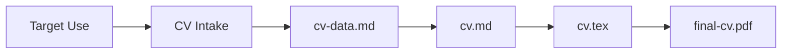
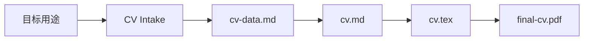

# paperAgent (readme.md 文件全部由 qwen-coder 生成)

> A Codex skill for research paper writing, literature-grounded drafting, and LaTeX CV generation.

面向科研写作、文献证据链、论文草稿迭代和 LaTeX 简历生成的个人研究写作助手。


**Last Updated:** 2026-04-26

---

## 🌐 Language / 语言切换

| [**English Version**](#english-version) | [**中文版本**](#中文版本) |
|----------------------------------------|--------------------------|
| For international users                | 面向中文用户              |

---

<a name="english-version"></a>
## What is paperAgent?

paperAgent is **not** a "input topic, get full paper" one-shot generator. It is an interactive research-writing assistant that:

- Starts by asking a few high-value questions to clarify paper type, language, scope, and constraints
- Breaks the writing process into traceable stages: intake → brief → search plan → notes & references → outline → draft → revision → final DOCX
- Emphasizes evidence chains, source quality, technical reasoning, and auditable inference
- Reduces repetition and AIGC-like phrasing through structural revision and expression refinement
- Supports LaTeX CV / resume generation with classic, compact, modern, and academic styles

It is designed for researchers, students, and practitioners who want a **human-in-the-loop** writing workflow rather than black-box text generation.

---

## Features

### Paper Workflow

| Feature | Description |
|---------|-------------|
| 🎯 Guided topic clarification | Interactive interview to sharpen problem, scope, and angle |
| 🔍 Search query planning | Keyword extraction, synonym expansion, exclusion rules |
| 📚 Literature triage | Source priority: peer-reviewed → preprints → docs → blogs → news |
| 🏗️ Outline construction | Defensible argument structure before prose drafting |
| ✍️ Manuscript drafting | Original language writing, not summary stitching |
| 🔁 Revision & refinement | Lower repetition and AIGC-like phrasing |
| 📄 DOCX export | Deliverable `final-manuscript.docx` |

### CV Workflow

| Feature | Description |
|---------|-------------|
| 🎓 Academic CV | Complete publication list, research outputs, service |
| 💼 Research internship resume | Projects, methods, skills, publications/preprints |
| 🏭 Industry resume | One-page, ATS-friendly, outcome-oriented bullets |
| 🌐 Language support | Chinese, English, bilingual output |
| 🎨 Template styles | Classic, compact, modern, academic LaTeX templates |
| 📝 Compilation | XeLaTeX / Overleaf support, optional PDF export |

---

## Workflow Diagram

### Paper Writing Flow


### CV/Resume Flow



---

## Quick Start

The installable unit is the `paper-agent/` directory (not the old `skills/` folder).

### Installation

**Windows:**
```powershell
Copy-Item -Recurse .\paper-agent $env:USERPROFILE\.codex\skills\
```

**macOS / Linux:**
```bash
cp -r ./paper-agent ~/.codex/skills/
```

### Verify Installation

**PowerShell:**
```powershell
$skillPath = "$env:USERPROFILE\.codex\skills\paper-agent"
Test-Path "$skillPath\SKILL.md" -and `
Test-Path "$skillPath\ref\interactive-intake.md" -and `
Test-Path "$skillPath\script\export_final_docx.py"
```

**Bash:**
```bash
skill_path="$HOME/.codex/skills/paper-agent"
[ -f "$skill_path/SKILL.md" ] && \
[ -f "$skill_path/ref/interactive-intake.md" ] && \
[ -f "$skill_path/script/export_final_docx.py" ] && \
echo "OK" || echo "FAIL"
```

Expected layout:
```
~/.codex/skills/paper-agent/
├── SKILL.md
├── ref/
│   ├── citation-style.md
│   ├── cv-latex-guide.md
│   ├── interactive-intake.md
│   ├── paper-template.md
│   ├── quality-checklist.md
│   └── source-priority.md
└── script/
    ├── build_search_queries.py
    ├── compile_latex_cv.ps1
    ├── export_final_docx.py
    ├── init_cv_project.py
    └── init_paper_project.ps1
```

---

## Project Structure

```text
paperAgent/
├── paper-agent/          # Self-contained Codex skill package
│   ├── SKILL.md          # Main skill definition (entry point)
│   ├── ref/              # Reference documents
│   └── script/           # Helper scripts
├── papers/               # Paper projects (user workspace)
├── cvs/                  # CV/resume projects (user workspace)
├── ref/                  # Repository-level references
├── script/               # Helper scripts at repo level
└── log/                  # Task and revision logs
```

**Important:**
- `paper-agent/` is the core publishable and installable unit
- `papers/`, `cvs/`, `log/` are user workspaces — do not commit real private content
- All files are UTF-8 encoded

---

## Example Usage

```text
Use paperAgent to help me write a Chinese course paper about cache coherence in heterogeneous architecture.
```

```text
Create an academic CV in English for a PhD application, using a clean LaTeX style.
```

```text
Help me turn this rough idea into a defensible paper outline before drafting.
```

---

## My Stack

This project uses/adapts the following tools and technologies:

| Category | Tools |
|----------|-------|
| **Core** | Codex skill system |
| **Format** | Markdown as intermediate writing format |
| **Scripts** | Python helper scripts, PowerShell wrappers (Windows) |
| **Export** | DOCX export via Python script |
| **Typesetting** | LaTeX / XeLaTeX for CV generation |
| **Cloud** | Overleaf-compatible LaTeX source |
| **Optional** | Chrome for literature search |
| **Optional** | Zotero for reference management |
| **Optional** | Microsoft Word for final document polishing |

---

## Inspiration

This project was motivated by several observations about academic writing and AI assistance:

- **Real academic writing is iterative**, not one-shot generation. Papers evolve through clarification, evidence gathering, outlining, drafting, and revision.
- **Problem framing matters more than prose generation.** A well-scoped problem leads to better papers than polished writing on vague ideas.
- **Literature should be evidence, not decoration.** Citations should support claims, not just signal familiarity with the field.
- **AI assistants should expose assumptions.** Uncertainty, source quality, and reasoning limits should be visible, not hidden.
- **CVs should avoid fabricated achievements.** Editable LaTeX source and honest representation matter more than impressive-looking lies.
- **Lightweight local organization wins.** Simple directory conventions and traceable files beat complex databases for personal workflows.

The design draws inspiration from advisor-style research discussions, reproducible writing practices, and minimal tooling that stays out of the way.

---

## Future Ideas

### Near-term

- [ ] Add README screenshots or terminal demo GIF
- [ ] Add example paper project with sanitized files
- [ ] Add example CV project with fake sample data
- [ ] Add install verification script
- [ ] Add English README section or bilingual README

### Mid-term

- [ ] Zotero integration workflow
- [ ] BibTeX / CSL citation export
- [ ] Paper metadata extraction from PDFs
- [ ] Configurable writing templates (thesis, survey, technical report, conference paper)
- [ ] Better DOCX styling templates
- [ ] Automated quality checklist report

### Long-term

- [ ] Local literature database
- [ ] Paper graph / citation map visualization
- [ ] Multi-agent review mode (advisor, reviewer, editor roles)
- [ ] Benchmark-style evaluation for hallucinated citations
- [ ] Integration with Overleaf or GitHub Actions for LaTeX compilation
- [ ] Project dashboard for paper status, references, TODOs, and revision history

---

## Design Rules

This README and the project follow these principles:

✅ **Do:**
- Use clear headings, tables, badges, and Mermaid diagrams
- Emphasize evidence-grounded writing and traceability
- Keep human-in-the-loop at the center
- Maintain bilingual accessibility (Chinese + English keywords)

❌ **Don't:**
- Overuse emoji
- Write marketing copy
- Claim automatic completion of real research
- Promise "undetectable by plagiarism checkers" or "bypass AI detection"
- Present future ideas as existing features

---

## Key Files

| File | Purpose |
|------|---------|
| [`paper-agent/SKILL.md`](paper-agent/SKILL.md) | Skill entry point |
| [`ref/interactive-intake.md`](ref/interactive-intake.md) | Interview guidelines |
| [`ref/paper-template.md`](ref/paper-template.md) | Paper structure template |
| [`ref/citation-style.md`](ref/citation-style.md) | Citation conventions |
| [`ref/quality-checklist.md`](ref/quality-checklist.md) | Quality criteria |
| [`ref/source-priority.md`](ref/source-priority.md) | Source ranking |
| [`ref/cv-latex-guide.md`](ref/cv-latex-guide.md) | LaTeX CV guide |
| [`script/export_final_docx.py`](script/export_final_docx.py) | DOCX export |
| [`script/init_cv_project.py`](script/init_cv_project.py) | CV project initializer |

---

## License

Same as the parent paperAgent project.

---

<a name="中文版本"></a>
## paperAgent 是什么？

paperAgent **不是**一个"输入题目直接生成全文"的一次性工具。它是一个交互式的研究写作助手，能够：

- 通过少量高价值问题澄清论文类型、语言、范围、约束条件
- 将写作过程拆分为可追溯的阶段：intake → brief → search plan → notes & references → outline → draft → revision → final DOCX
- 强调证据链、来源质量、技术推理和可审查的推断过程
- 通过结构化修改和表达优化降低重复率和 AIGC 风格的措辞
- 支持 LaTeX CV / resume 生成，提供 classic、compact、modern、academic 等多种风格

它专为研究人员、学生和从业者设计，提供**人在回路（human-in-the-loop）**的写作工作流，而非黑盒文本生成。

---

## 功能特性

### 论文写作流程

| 功能 | 描述 |
|---------|-------------|
| 🎯 引导式主题澄清 | 交互式访谈，明确问题、范围和角度 |
| 🔍 搜索查询规划 | 关键词提取、同义词扩展、排除规则 |
| 📚 文献筛选 | 来源优先级：同行评审 → 预印本 → 文档 → 博客 → 新闻 |
| 🏗️ 大纲构建 | 在撰写正文前建立可辩护的论证结构 |
| ✍️ 草稿撰写 | 原创性语言写作，而非摘要拼接 |
| 🔁 修订与优化 | 降低重复率和 AIGC 风格的措辞 |
| 📄 DOCX 导出 | 交付 `final-manuscript.docx` |

### CV/简历流程

| 功能 | 描述 |
|---------|-------------|
| 🎓 学术 CV | 完整的出版物列表、研究成果、服务经历 |
| 💼 研究实习简历 | 项目、方法、技能、出版物/预印本 |
| 🏭 工业界简历 | 单页、ATS 友好、结果导向的描述 |
| 🌐 语言支持 | 中文、英文、双语输出 |
| 🎨 模板风格 | Classic、compact、modern、academic LaTeX 模板 |
| 📝 编译支持 | XeLaTeX / Overleaf 支持，可选 PDF 导出 |

---

## 工作流程图

### 论文写作流程


### CV/简历流程



---

## 快速开始

可安装单元是 `paper-agent/` 目录（而非旧的 `skills/` 文件夹）。

### 安装

**Windows:**
```powershell
Copy-Item -Recurse .\paper-agent $env:USERPROFILE\.codex\skills\
```

**macOS / Linux:**
```bash
cp -r ./paper-agent ~/.codex/skills/
```

### 验证安装

**PowerShell:**
```powershell
$skillPath = "$env:USERPROFILE\.codex\skills\paper-agent"
Test-Path "$skillPath\SKILL.md" -and `
Test-Path "$skillPath\ref\interactive-intake.md" -and `
Test-Path "$skillPath\script\export_final_docx.py"
```

**Bash:**
```bash
skill_path="$HOME/.codex/skills/paper-agent"
[ -f "$skill_path/SKILL.md" ] && \
[ -f "$skill_path/ref/interactive-intake.md" ] && \
[ -f "$skill_path/script/export_final_docx.py" ] && \
echo "OK" || echo "FAIL"
```

预期布局:
```
~/.codex/skills/paper-agent/
├── SKILL.md
├── ref/
│   ├── citation-style.md
│   ├── cv-latex-guide.md
│   ├── interactive-intake.md
│   ├── paper-template.md
│   ├── quality-checklist.md
│   └── source-priority.md
└── script/
    ├── build_search_queries.py
    ├── compile_latex_cv.ps1
    ├── export_final_docx.py
    ├── init_cv_project.py
    └── init_paper_project.ps1
```

---

## 项目结构

```text
paperAgent/
├── paper-agent/          # 独立的 Codex skill 包
│   ├── SKILL.md          # 主 skill 定义（入口点）
│   ├── ref/              # 参考文档
│   └── script/           # 辅助脚本
├── papers/               # 论文项目（用户工作区）
├── cvs/                  # CV/简历项目（用户工作区）
├── ref/                  # 仓库级参考文档
├── script/               # 仓库级辅助脚本
└── log/                  # 任务和修订日志
```

**重要说明:**
- `paper-agent/` 是核心发布和安装单元
- `papers/`、`cvs/`、`log/` 是用户工作区 — 请勿提交真实私人内容
- 所有文件均为 UTF-8 编码

---

## 使用示例

```text
Use paperAgent to help me write a Chinese course paper about cache coherence in heterogeneous architecture.
```

```text
Create an academic CV in English for a PhD application, using a clean LaTeX style.
```

```text
Help me turn this rough idea into a defensible paper outline before drafting.
```

---

## 我的工具栈

本项目使用/适配以下工具和技术：

| 类别 | 工具 |
|----------|-------|
| **核心** | Codex skill 系统 |
| **格式** | Markdown 作为中间写作格式 |
| **脚本** | Python 辅助脚本、PowerShell 包装器（Windows） |
| **导出** | 通过 Python 脚本导出 DOCX |
| **排版** | LaTeX / XeLaTeX 用于 CV 生成 |
| **云端** | Overleaf 兼容的 LaTeX 源码 |
| **可选** | Chrome 用于文献搜索 |
| **可选** | Zotero 用于参考文献管理 |
| **可选** | Microsoft Word 用于最终文档润色 |

---

## 灵感来源

本项目的动机源于对学术写作和 AI 辅助的几个观察：

- **真正的学术写作是迭代的**，而非一次性生成。论文通过澄清、证据收集、大纲、草稿和修订逐步演进。
- **问题框架比文字生成更重要。** 明确的问题范围比模糊想法上的华丽文字更能产生好论文。
- **文献应该是证据，而非装饰。** 引用应该支持论点，而不只是展示对领域的熟悉度。
- **AI 助手应该暴露假设。** 不确定性、来源质量和推理限制应该可见，而非隐藏。
- **CV 应该避免虚构成就。** 可编辑的 LaTeX 源码和诚实的表述比看起来令人印象深刻但虚假的内容更重要。
- **轻量级本地组织更有效。** 简单的目录约定和可追溯的文件胜过个人工作流中的复杂数据库。

设计灵感来源于导师式的研究讨论、可复现的写作实践和最小化干扰的工具理念。

---

## 未来设想

### 近期计划

- [ ] 添加 README 截图或终端演示 GIF
- [ ] 添加示例论文项目（脱敏文件）
- [ ] 添加示例 CV 项目（虚拟样本数据）
- [ ] 添加安装验证脚本
- [ ] 添加英文 README 部分或双语 README ✅

### 中期计划

- [ ] Zotero 集成工作流
- [ ] BibTeX / CSL 引用导出
- [ ] 从 PDF 提取论文元数据
- [ ] 可配置的写作模板（论文、综述、技术报告、会议论文）
- [ ] 更好的 DOCX 样式模板
- [ ] 自动化质量检查清单报告

### 长期计划

- [ ] 本地文献数据库
- [ ] 论文图谱 / 引用地图可视化
- [ ] 多 Agent 评审模式（导师、审稿人、编辑角色）
- [ ] 针对幻觉引用的基准式评估
- [ ] 与 Overleaf 或 GitHub Actions 集成进行 LaTeX 编译
- [ ] 项目仪表板，显示论文状态、参考文献、TODO 和修订历史

---

## 设计原则

本 README 和项目遵循以下原则：

✅ **应该做:**
- 使用清晰的标题、表格、徽章和 Mermaid 图
- 强调基于证据的写作和可追溯性
- 以人在回路为中心
- 保持双语可访问性（中文 + 英文关键词）

❌ **不应该做:**
- 过度使用 emoji
- 写成营销文案
- 声称自动完成真实科研
- 承诺"不被查重检测"或"绕过 AI 检测"
- 将未来设想呈现为现有功能

---

## 关键文件

| 文件 | 用途 |
|------|---------|
| [`paper-agent/SKILL.md`](paper-agent/SKILL.md) | Skill 入口点 |
| [`ref/interactive-intake.md`](ref/interactive-intake.md) | 访谈指南 |
| [`ref/paper-template.md`](ref/paper-template.md) | 论文结构模板 |
| [`ref/citation-style.md`](ref/citation-style.md) | 引用规范 |
| [`ref/quality-checklist.md`](ref/quality-checklist.md) | 质量标准 |
| [`ref/source-priority.md`](ref/source-priority.md) | 来源排名 |
| [`ref/cv-latex-guide.md`](ref/cv-latex-guide.md) | LaTeX CV 指南 |
| [`script/export_final_docx.py`](script/export_final_docx.py) | DOCX 导出 |
| [`script/init_cv_project.py`](script/init_cv_project.py) | CV 项目初始化器 |

---

## 许可证

与父项目 paperAgent 相同。

